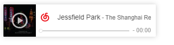

# my-notion
我的notion页面库

页面传入配置，第一个配置用`?`来拼接，后面的都用`&`

例如：`https://shmilybaozi.github.io/my-notion/notion/music.html?size=small&width=360`

1. [历史上的今天](https://shmilybaozi.github.io/my-notion/notion/history-today.html)
2. [淡黄色字块](https://shmilybaozi.github.io/my-notion/notion/quote.html?text=正经人谁写日记啊)
   - 地址中 `?text=正经人谁写日记啊` 可以把【正经人谁写日记啊】替换成任何想要的内容
   - 中文效果
     - 
   - 英文效果_会自动转化成大写
     - 
3. [年月周进度条](https://shmilybaozi.github.io/my-notion/notion/progress.html?color=8A9FBE,7F8A86,D1958B)
    - 自定义颜色效果
    - `&color=8A9FBE,7F8A86,D1958B` 可以写 3 个 16 进制颜色，默认是 `7E565A,A59A9A,534546`
        - 
    - 默认颜色效果，地址删除`&color=8A9FBE,7F8A86,D1958B` 就是默认效果
      - 
4. [网易云音乐播放器](https://shmilybaozi.github.io/my-notion/notion/music.html?id=1234705&size=small)
    - `?id=1234705` 传歌曲的id就能替换成想要的歌，可以在网易云音乐中复制歌曲连接获取
        - `https://music.163.com/song?id=1234705&userid=6837957` 其中id就是歌曲id
    - **只有不需要VIP的歌曲才能外链这样播放**
    - 可以选择两种尺寸
        - `&size=small` 可以写 `big` 或者 `smamll`，默认不传的话是大尺寸
            - 
            - 
    - `&width=360` 可以写你想要的宽度，范围是 280－530
    
